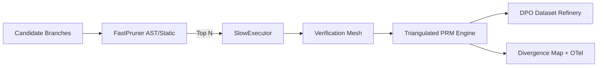

# Entropy-RLAF

Entropy-RLAF is an **Environment-Grounded Alignment Framework** for agentic LLM systems.
It triangulates three signals for every candidate action:

1. **Latent** critic opinion (LLM-side confidence)
2. **Deterministic** policy/static checks (AST/security constraints)
3. **Empirical** sandbox reality (isolated execution)

The Prime Directive: never create a preference pair unless the chosen trajectory materially succeeds in isolated execution and has step-wise verified process rewards.

## Why this matters

Pure LLM-on-LLM evaluation can be brittle under jailbreaks, prompt injection, and hallucinations.
Entropy-RLAF treats critic output as one signal—not ground truth—and gates learning data through deterministic + environmental verification.

## Quickstart

```bash
python -m venv .venv
source .venv/bin/activate
pip install -e .[dev]
python demo.py
pytest
```

## Architecture



## Repo layout

- `entropy_rlaf/core`: abstract contracts + shared models
- `entropy_rlaf/plugins`: phase-1 verifiers (AST + SQLite rollback)
- `entropy_rlaf/orchestrator`: fast-prune and slow-execute search loop
- `entropy_rlaf/verification_mesh`: pluggable mesh and stubs
- `entropy_rlaf/engine`: triangulated process reward model
- `entropy_rlaf/refinery`: DPO JSONL writer with fidelity filtering
- `entropy_rlaf/telemetry`: divergence map and OpenTelemetry spans
- `demo.py`: secure pipeline demo scenario

## Security posture

- Security-first parsing with AST checks before execution.
- Transactional rollback to avoid cross-branch state bleed.
- Fidelity-based meta-correction to reduce critic over-trust.
- Designed for byzantine tolerance via verifier and critic ensembling.
